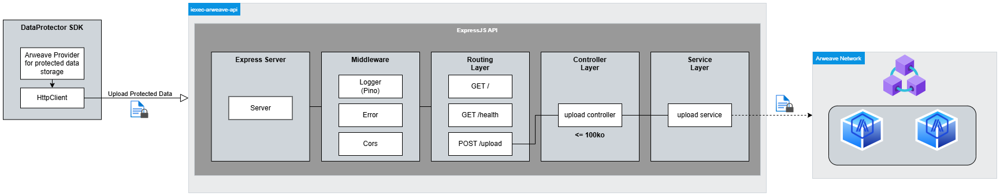

# 🌐 iexec-arweave-api

**iexec-arweave-api** is an HTTP API that allows file uploads and pushes them to the [Arweave](https://www.arweave.org) decentralized storage network.

It enforces a file size limit (100KB), provides structured logging, clean error handling, and a service-oriented architecture ready for containerized deployment.

This API is used via the [dataprotector-sdk](https://github.com/iExecBlockchainComputing/dataprotector-sdk) to upload datasets directly to Arweave if desired (IPFS otherwise).



---

## 📦 Tech Stack
* Node.js 22 + Express
* TypeScript
* Multer for file parsing
* Pino for logging
* Vitest for testing

## 🗂 Project Structure and stack

``` sh
src/
├── index.ts # App entrypoint
├── types.ts # FileUploadError interface
├── middleware/ # Custom Express middleware
│ ├── error.ts # Global error handler
│ ├── logger.ts # Request logging
│ └── not-found.ts # 404 handler
├── upload/ # Upload feature
│ ├── upload.controller.ts # HTTP request handling
│ ├── upload.routes.ts # Express router
│ └── upload.service.ts # Arweave integration logic
└── utils/
  └── logger.ts # Pino logger setup
```

---

## 🚩 Getting Started


### Install dependencies

```sh
npm install
```

### 🚀 Run in development

```sh
npm run dev

#Or with pretty logging:
npm run dev:pretty
```

### 🧪 Testing
Unit tests are written using Vitest.
```sh
npm run test
```

### 🧹 Code Quality
Check types, format code, and lint:

```sh
npm run check-types
npm run format
npm run lint
```

### 🎉 Sample

Start API
```sh
npm run dev
```

In other terminal

```sh
echo "Try to add a file to arweave" > demo.txt
curl -X POST http://localhost:3000/upload -F "file=@demo.txt" | jq

{
  "arweaveId": "n-JSY0BRWyVWIKsav8JuPUZymwFZArRhBlqHKlcfmqs",
  "url": "https://arweave.net/n-JSY0BRWyVWIKsav8JuPUZymwFZArRhBlqHKlcfmqs"
}

```

### 🩺 Health checks

A health endpoint (`/health`) is enabled by default
This endpoint allows to define health checks in an orchestrator or a [compose file](https://github.com/compose-spec/compose-spec/blob/master/spec.md#healthcheck).

### 🚨 Error Handling
Files exceeding the 100KB limit are rejected with HTTP 413 Payload Too Large.
All unhandled errors return HTTP 500 with a structured error response.
Requests to unknown endpoints return HTTP 404.

## 📋 License
This repository code is released under the [Apache License 2.0](LICENSE).
